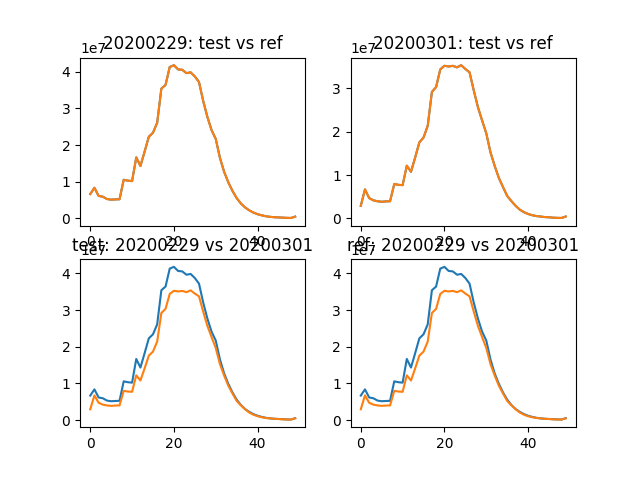

# Validation against copies of the mozaggregator database

These scripts run validation to determine whether two databases contain the same
aggregate data for a day. This requires boto3 to be configured correctly on the
host machine.

```bash
script/validation/entrypoint.sh <reference host> <test host> <date in YYYYMMDD>
```

## Results

Error is the percentage difference between three statistics:
* Number of aggregate rows for the reference date
* Sum of all histogram sums for the reference date
* Sum of all histogram counts for the reference date

```python
  submission_date     test      ref  err
0        20200229  2936771  2936771  0.0
1        20200301  2826848  2826848  0.0

              sum_test              sum_ref sum_err
0  2626701384304806794  2626701384304806794       0
1  2015714821244959696  2015714821244959696       0

   count_test   count_ref count_err
0  4192687908  4192687908         0
1  3461041798  3461041798         0
```

The plot shows the `GC_MS` histogram using the reference date and prior date
across both databases.


